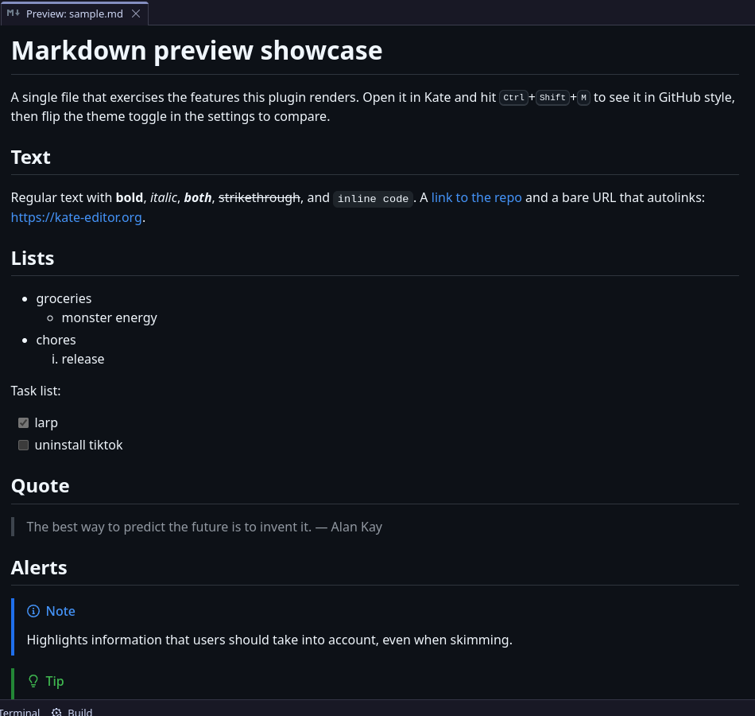
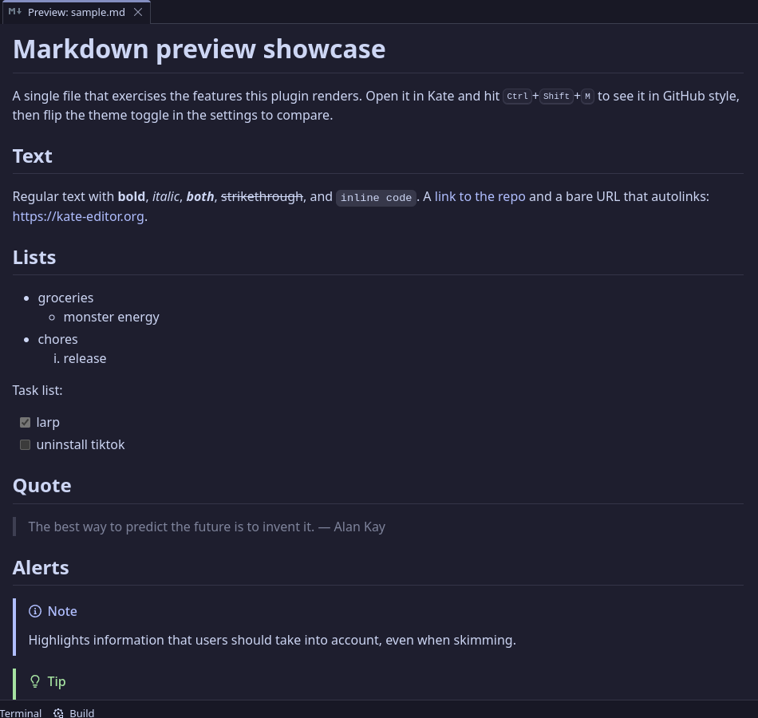
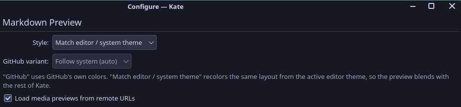
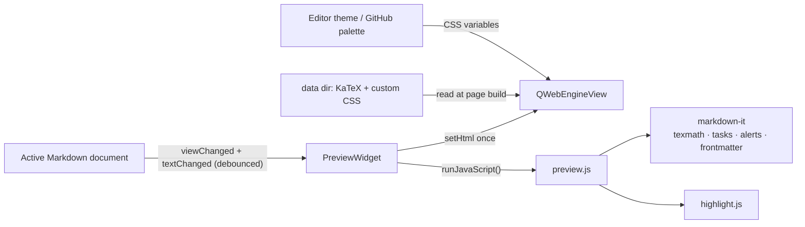

<div align="center">

# Katexdown

**Markdown preview for Kate in a side panel: KaTeX math, custom stylesheets,
follows the active document. A katdown fork — GitHub theme by default, with the
built-in stylesheet optional and replaceable.**

[](LICENSE)
&nbsp;
&nbsp;

</div>

This is a fork of [katdown](https://github.com/uwuclxdy/katdown) that renames it
to **Katexdown** (so it is unmistakably not vanilla katdown and can even be
installed next to it) and adds: a preview panel that follows the active
document, KaTeX math, custom stylesheets, a built-in-GitHub-CSS on/off switch,
and HTML export.

It renders with the actual [github-markdown-css](https://github.com/sindresorhus/github-markdown-css), so headings, tables, blockquotes, task lists, and alerts match github.com by default. Fully offline.

## Screenshots

| GitHub style | Theme-matched style |
| :----------: | :-----------------: |
|  |  |

## Installation

### Arch Linux (recommended)

### Arch Linux (local package, no AUR entry needed)

The repository ships a ready-made PKGBUILD. Build it straight from this folder
(makepkg takes care of dependencies and installation):

```bash
cd katexdown/aur        # the aur/ directory inside this repository
makepkg -f -si          # installs katexdown-git system-wide
```

The `-f` forces a rebuild — whenever you change the source, old package
archives in `aur/` would otherwise make makepkg silently reinstall the previous
build instead of compiling the new code.

Then enable it: Settings -> Configure Kate -> Plugins -> check **Katexdown**.

> [!NOTE]
> If you later publish this fork on GitHub, point `source=` in `aur/PKGBUILD`
> at your repository and the same PKGBUILD can go to the AUR as-is.

### Build from source (any Linux)

```bash
git clone <this-repo> katexdown
cd katexdown
cmake -B build -S . -DCMAKE_BUILD_TYPE=RelWithDebInfo -DCMAKE_INSTALL_PREFIX=/usr
cmake --build build
sudo cmake --install build        # system-wide
# or user-local:
# cmake --install build --prefix ~/.local
# printf 'QT_PLUGIN_PATH=%s/.local/lib/qt6/plugins\n' "$HOME" > ~/.config/environment.d/katexdown.conf
```

Enable the plugin after installing: Settings -> Configure Kate -> Plugins -> check Katexdown.

### Windows

Building on Windows needs [KDE Craft](https://community.kde.org/Craft) with MSVC
2022 (the plugin must match the ABI of Kate's own Qt build). The repository
contains the upstream Windows workflow (`.github/workflows/windows.yml`) and the
installer script (`packaging/windows/install.ps1`); if you push this fork to
GitHub and enable Actions, each tagged release produces a zip that installs
with one command in an **elevated** PowerShell:

```powershell
powershell -ExecutionPolicy Bypass -File install.ps1     # -KateDir "D:\Kate" if needed
```

Notes for Windows:

- Kate must come from the [installer](https://kate-editor.org/get-it/); the
  Microsoft Store version is not supported.
- Kate for Windows ships no Qt WebEngine, so the zip packs it (about 90 MB,
  ~220 MB unpacked) and installs it next to `kate.exe`, where Windows looks
  for plugin dependencies.

### macOS

Kate is [available for macOS](https://kate-editor.org/get-it/) (KDE binary
factory / `brew install --cask kate`). The Katexdown code is plain Qt6/KF6 and
is cross-platform in principle, but there is **no prebuilt installer for macOS
yet** — the app bundle ships its own Qt/KF frameworks, so a plugin compiled
against system libraries will not load. The supported path is building the
whole KDE stack with [Craft](https://community.kde.org/Craft) (the same tooling
as the Windows build) and letting it build this plugin against kate's
frameworks:

```bash
craft --package kate
craft --package katexdown   # after adding a Craft blueprint, or:
craft katexdown             # local recipes via craft's local overlay
```

If that is too much machinery, run kate in a Linux VM/container and install
there — the plugin behaves identically.

### Requirements (all platforms)

- Kate / KTextEditor 6 (KF6)
- Qt 6 with WebEngine
- Optional: Python 3 (only for `tools/fetch-assets.py`, the KaTeX downloader)

On Arch the dependencies are:

```bash
sudo pacman -S --needed base-devel cmake extra-cmake-modules \
    ktexteditor qt6-webengine kcoreaddons ki18n kconfig kxmlgui ksyntaxhighlighting
```

> [!NOTE]
> Qt WebEngine is initialized from inside Kate. On some setups you may see a console warning about `Qt::AA_ShareOpenGLContexts`. It is harmless in practice.

## Usage

Open any Markdown file in Kate:

```bash
kate path/to/notes.md
```

Then trigger the preview in one of three ways:

- press <kbd>Ctrl</kbd>+<kbd>Shift</kbd>+<kbd>M</kbd>, or
- click the Katexdown button in the main toolbar (Settings, then Toolbars Shown, then Main Toolbar if it is hidden), or
- use Tools, then Katexdown.

The preview opens in a **side panel** (a tool view on the right), so source and
preview stay visible side by side — the preview never covers the document. Once
the panel exists it **follows the active document**: focus any Markdown file and
the preview switches to it, and clicking a link inside the preview opens the
target in the editor, where it becomes the active document and the preview
follows automatically. Non-Markdown documents leave the last content frozen in
the panel. The panel's visibility is remembered across sessions; kate also
registers its own "Show Preview" toggle in the View menu. The Tools menu adds an
"Export HTML…" entry for saving the current preview as a standalone .html file.

A small round button pinned to the bottom-right corner of the preview opens the
document's **section outline**: click any entry to jump straight to that
heading. Which heading levels it lists is configurable (H1–H5 by default).

## Loading & memory

The preview is a web view with its own renderer process — that is what costs
memory. Katexdown splits it into a cheap part (the panel shell, which always
exists so kate's sidebar button, View menu and session restore work) and the
heavy part (the web view), whose lifetime follows the **Preview loading**
setting on the config page:

| Mode | When the web view exists | When it is freed |
|------|--------------------------|------------------|
| Lazy (default) | first time the preview is opened | closed panel is frozen (no CPU, toggling stays instant); after ~1 minute closed the page is released, and re-opening restores it automatically |
| Lazy + free on close | first time the preview is opened | destroyed on every close; re-opening rebuilds it (a short delay) |
| Eager | at Kate startup (plugin enabled) | frozen while closed; only when Kate exits |

With either lazy mode, Kate runs with no extra renderer process until you
actually open a preview. Toggling through kate's own "Show Preview" menu entry
or the sidebar button follows the same rules. Note: after a restart the panel
opens closed in the lazy modes (that is the point — nothing loaded until asked).

A rendered page never frees its renderer's memory on its own: the Chromium
engine behind the web view only gives memory back when its process ends, and
Qt will not let a *visible* page be frozen or discarded. So while a preview
stays open through a long session, Katexdown **recycles the renderer** for it:
it estimates the dead memory a long-lived renderer accumulates (every full
re-render costs it a chunk proportional to the document, with no natural
plateau — measured in the hundreds of MB for large documents) and, once that
passes a budget, restarts the renderer at a moment you would not notice: a
document switch already reloads the page, and when you simply pause reading or
typing, the page is recreated in place with your scroll position kept (see
`design/lazyrender.md`). Between recycles, switching between documents that
live in the same folder re-renders in place instead of reloading the whole
page, which keeps that churn small in the first place. The closed-panel rules
above remain the biggest lever: a preview left closed releases its renderer
entirely.

A renderer's JavaScript (V8) heap is additionally capped — 128 MB by default,
configurable on the settings page (0 turns it off). V8 then reclaims what
full re-renders leave behind itself, instead of the memory only ever coming
back when the renderer process is recycled, so a long session plateaus rather
than spiking between recycles. The cap is invisible while a document's
rendering fits under it; very large or math-heavy documents can re-render
slower under a low cap (the engine has to free memory mid-render), so it can
be raised or switched off for those. The engine reads the cap only when it
starts, so changing it needs a Kate restart.

A preview page is also trimmed to the document at hand: KaTeX, the syntax
highlighter and the YAML front-matter parser are only loaded when the current
document actually uses math, fenced code blocks or front matter (a page
refreshes itself once when you type such content in later).

Inside a rendered page the same idea applies to images — the **Image memory
mode** setting decides how much the web engine decodes at once:

| Mode | Image behavior in the preview |
|------|-------------------------------|
| Eager | every image decodes as soon as it is rendered — the classic, heaviest behavior |
| Auto (default) | images decode only as they approach the viewport; once a document grows many images (roughly a dozen or more), off-screen decoded memory is released again |
| Memory-saver | only images near the viewport ever decode; each is released the moment it scrolls out of the keep zone, so renderer memory stays flat no matter how many images the document has |

Hundreds of images at once are what makes a web engine heavy: every decoded
photo is width × height × 4 bytes in the renderer. The lazy decode + keep-zone
unloading lives in `data/js/preview.js` (parked images keep their layout box
via dimensions recorded on first decode, so scrolling stays stable), and it
only ever affects the *live* page — **Export HTML…** always writes plain,
eager images into the standalone file.

## Math (LaTeX) and custom stylesheets

Both are optional and read from the plugin's **data directory** — no
environment variables or flags needed on any OS. The plugin picks a
conventional per-platform location automatically (also shown in the settings
page, which has an *Open data folder…* button):

| OS      | Data directory                                   |
|---------|--------------------------------------------------|
| Linux   | `~/.config/katexdown`                            |
| Windows | `%APPDATA%\katexdown` (`AppData\Roaming\katexdown`) |
| macOS   | `~/Library/Application Support/katexdown`        |

Math needs KaTeX, downloaded once and cached until you update it manually.
Run this once from the repository (no arguments — it writes into the same
default directory the plugin reads, per OS):

```bash
python3 tools/fetch-assets.py
```

For development the location can be overridden with `$KATEXDOWN_DATA_DIR` or a
directory argument (`python3 tools/fetch-assets.py SOME_DIR`); normal use never
needs either.

Once the assets exist, `$...$` and `$$...$$` render with KaTeX. Without them,
`$` stays literal and everything else keeps working — the preview stays fully
offline either way.

Custom stylesheets are added in the settings page (Add…/Remove/order buttons);
relative paths resolve against the same data directory. They are appended after
the built-in GitHub stylesheet, in listed order, so a later file can override an
earlier one — including the CSS custom properties that drive the color scheme.

The **"Use the built-in GitHub stylesheet"** checkbox (on by default) switches
the bundled github-markdown.css off entirely, so your custom stylesheets own
the whole layout instead of layering on GitHub's look. With it off and no
custom stylesheet configured the preview shows only the bare page chrome.

**Export HTML…** (Tools menu) writes the currently rendered preview — content,
math, and *all* included CSS (bundled or custom, KaTeX included) — into a
standalone `.html` file you can share or print.

## Configuration

Settings -> Configure Kate -> (Plugins -> enable `Katdown`) -> Katdown.



| Setting | Options | What it does |
|---------|---------|--------------|
| Style | GitHub / Match editor or system theme | GitHub uses GitHub's palette. Match recolors the same layout from your active editor theme. |
| GitHub variant | Auto / Light / Dark | Which GitHub palette to use. Auto follows whether your system is light or dark. Only applies in GitHub style. |
| Load media previews from remote URLs | On / Off (default) | When on, images referencing `http(s)` URLs are fetched and rendered. When off (the default), the preview loads no remote resources and works fully offline. Images with paths relative to the document always load regardless of this setting. |
| JS memory cap | 0–1024 MB (0 = off; default 128) | Bounds the preview's JavaScript (V8) heap, so memory that full re-renders leave behind is reclaimed by the engine itself instead of only on a renderer restart. Free while a document's rendering fits under it; large or math-heavy documents can re-render slower under a low cap. Applies when the preview's web engine starts — change needs a Kate restart. An explicit `--js-flags=…` in the `QTWEBENGINE_CHROMIUM_FLAGS` environment variable overrides it. |
| Section outline | H1–H6 checkboxes | Which heading levels the floating outline button in the preview lists; click an entry to jump to that section. H1–H5 are on by default; unchecking all hides the button. |
| Custom stylesheets | list | Files appended after the built-in style, in listed order. Relative paths resolve against the Katdown data dir. |

Change the shortcut under Settings, then Configure Keyboard Shortcuts, search for Katdown.

<details>
    <summary><h2>How it works</h2></summary>

The preview is a `QWebEngineView` living in a `KTextEditor::MainWindow::createToolView()`
panel (kate's "tool view" side area), re-targeted at the active Markdown
document on every `viewChanged`. The page is one self-contained HTML document
with the bundled assets inlined, plus the optional data-dir extras (KaTeX and
user CSS) read at page build time — nothing loads over the network.



- Layout and typography come from `github-markdown-css`. The built-in color values are stripped out so the plugin can drive them from CSS custom properties.
- Markdown is parsed by [markdown-it](https://github.com/markdown-it/markdown-it). Small bundled plugins add task-list checkboxes and GitHub alerts, leading YAML frontmatter is parsed with [js-yaml](https://github.com/nodeca/js-yaml) into a metadata table, and [markdown-it-texmath](https://github.com/goessner/markdown-it-texmath) + [KaTeX](https://katex.org/) render math when downloaded.
- Code highlighting uses [highlight.js](https://github.com/highlightjs/highlight.js). In GitHub style it uses the github/github-dark themes. In theme-matched style the token colors are generated at runtime from `KTextEditor::View::theme()`, so they line up with the editor.

Code highlighting is close to GitHub but not byte-identical, because GitHub uses its own server-side highlighter rather than highlight.js. If needed, [starry-night](https://github.com/wooorm/starry-night) is a faithful port of GitHub's highlighter and could replace highlight.js.

</details> 

## Development

Build, then run Kate that loads the freshly built plugin without installing it:

```bash
cmake -B build -S . -DCMAKE_BUILD_TYPE=Debug
cmake --build build -j"$(nproc)"
QT_PLUGIN_PATH="$PWD/build/bin" kate some-file.md   # optional: KATEXDOWN_DATA_DIR=$PWD/runtime to keep assets in the repo
```

Tests render in a headless Chromium and keep their config out of your own Kate settings:

```bash
cmake -B build -S . -DCMAKE_BUILD_TYPE=RelWithDebInfo -DBUILD_TESTING=ON
cmake --build build
ctest --test-dir build --output-on-failure
```

Source layout:

- `src/plugin.*` plugin entry point and config page registration
- `src/pluginview.*` per-window action and the follow-mode tool-view panel
- `src/previewwidget.*` the web view, rendering, and theme derivation
- `src/configpage.*` the settings page
- `src/settings.*` persisted settings
- `src/katexdownpaths.h` per-platform data-dir resolution (env override only for tests/dev)
- `tools/fetch-assets.py` one-shot downloader for the optional KaTeX assets
- `data/` bundled HTML, CSS, JS, and the qrc

## Credits

- [github-markdown-css](https://github.com/sindresorhus/github-markdown-css) by Sindre Sorhus
- [markdown-it](https://github.com/markdown-it/markdown-it)
- [markdown-it-texmath](https://github.com/goessner/markdown-it-texmath) (downloaded on demand)
- [KaTeX](https://katex.org/) (downloaded on demand)
- [highlight.js](https://github.com/highlightjs/highlight.js)
- [js-yaml](https://github.com/nodeca/js-yaml)

## License

GPL-3.0-or-later. See [LICENSE](LICENSE).
