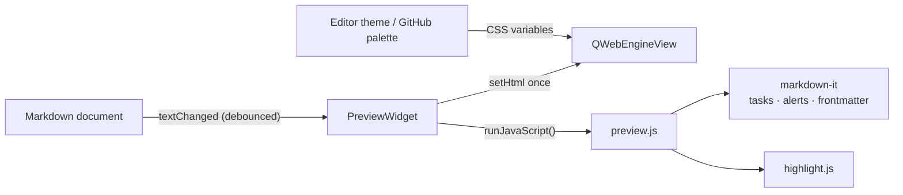

# Kate Markdown Preview

<div align="center">

<picture>
  <source media="(prefers-color-scheme: dark)" srcset="assets/header-dark.svg" />
  <source media="(prefers-color-scheme: light)" srcset="assets/header-light.svg" />
  
</picture>

[](LICENSE)
&nbsp;
&nbsp;
&nbsp;

</div>

A Kate plugin that opens a GitHub-styled preview of the Markdown file you are editing in a new tab, and updates it live as you type. Toggle between GitHub's own colors and your active editor/system theme.

## Screenshots

| GitHub style | Theme-matched style |
| :----------: | :-----------------: |
|  |  |

<!-- Placeholder paths. Drop assets/screenshot-github.png and assets/screenshot-app.png to populate this section. -->

## Why this exists

Kate's built-in preview uses a plain Qt renderer that looks nothing like GitHub. The other option, `kmarkdownwebview`, was abandoned in 2020 and never ported to KF6. This plugin fills that gap: it renders with the actual [github-markdown-css](https://github.com/sindresorhus/github-markdown-css), so headings, tables, blockquotes, task lists, and alerts match what you would see on github.com. It also runs fully offline. No API calls, no rate limits.

## Features

- Preview opens in a real tab next to your document, not a cramped side panel
- Live updates while you type (debounced)
- GitHub light and dark, picked automatically from your system, or forced
- A theme-matched mode that recolors the same GitHub layout from your active Kate editor theme, so code blocks use the exact same syntax colors as the editor
- GitHub Flavored Markdown: tables, strikethrough, autolinks, and `- [ ]` task list checkboxes
- GitHub alerts (`> [!NOTE]`, `[!TIP]`, `[!IMPORTANT]`, `[!WARNING]`, `[!CAUTION]`) with the matching octicons and colors
- YAML frontmatter rendered as a GitHub-style metadata table at the top of the file
- Toolbar button and a configurable <kbd>Ctrl</kbd>+<kbd>Shift</kbd>+<kbd>M</kbd> shortcut
- Everything is bundled. No network access at runtime

## Requirements

- Kate / KTextEditor 6 (KF6)
- Qt 6 with WebEngine

On Arch:

```bash
sudo pacman -S --needed base-devel cmake extra-cmake-modules \
    ktexteditor qt6-webengine kcoreaddons ki18n kconfig kxmlgui ksyntaxhighlighting
```

## Installation

Build it:

```bash
git clone https://github.com/uwuclxdy/kate-markdown-preview.git
cd kate-markdown-preview
cmake -B build -S . -DCMAKE_BUILD_TYPE=RelWithDebInfo -DCMAKE_INSTALL_PREFIX=/usr
cmake --build build
```

Then pick one of these.

System install (loads in every Kate launch):

```bash
sudo cmake --install build
```

User-local install (no root, but needs a re-login to take effect). The second command adds `~/.local/lib/qt6/plugins` to Qt's plugin search path so Kate finds it:

```bash
cmake --install build --prefix ~/.local
mkdir -p ~/.config/environment.d
printf 'QT_PLUGIN_PATH=%s/.local/lib/qt6/plugins\n' "$HOME" \
    > ~/.config/environment.d/kate-markdown-preview.conf
```

After installing, enable it: Settings, then Configure Kate, then Plugins, then check Markdown Preview (GitHub).

> [!NOTE]
> Qt WebEngine is initialized from inside Kate. On some setups you may see a console warning about `Qt::AA_ShareOpenGLContexts`. It is harmless in practice.

## Usage

Open any Markdown file in Kate:

```bash
kate path/to/notes.md
```

Then trigger the preview in one of three ways:

- press <kbd>Ctrl</kbd>+<kbd>Shift</kbd>+<kbd>M</kbd>, or
- click the Markdown Preview button in the main toolbar (Settings, then Toolbars Shown, then Main Toolbar if it is hidden), or
- use Tools, then Markdown Preview.

The button is greyed out unless the active tab is a Markdown document. The preview tab tracks the document and re-renders as you edit. Triggering it again focuses the existing tab instead of opening a second one.

## Configuration

Settings, then Configure Kate, then Markdown Preview.

| Setting | Options | What it does |
|---------|---------|--------------|
| Style | GitHub / Match editor or system theme | GitHub uses GitHub's palette. Match recolors the same layout from your active editor theme. |
| GitHub variant | Auto / Light / Dark | Which GitHub palette to use. Auto follows whether your system is light or dark. Only applies in GitHub style. |

Change the shortcut under Settings, then Configure Keyboard Shortcuts, search for Markdown Preview.

## How it works

The preview is a `QWebEngineView` added to Kate's tab area through `KTextEditor::MainWindow::addWidget`. The page is one self-contained HTML document with the assets inlined, so nothing loads over the network.



- Layout and typography come from `github-markdown-css`. The built-in color values are stripped out so the plugin can drive them from CSS custom properties.
- Markdown is parsed by [markdown-it](https://github.com/markdown-it/markdown-it). Small bundled plugins add task-list checkboxes and GitHub alerts, and leading YAML frontmatter is parsed with [js-yaml](https://github.com/nodeca/js-yaml) into a metadata table.
- Code highlighting uses [highlight.js](https://github.com/highlightjs/highlight.js). In GitHub style it uses the github/github-dark themes. In theme-matched style the token colors are generated at runtime from `KTextEditor::View::theme()`, so they line up with the editor.

Code highlighting is close to GitHub but not byte-identical, because GitHub uses its own server-side highlighter rather than highlight.js. If you want exact code colors, [starry-night](https://github.com/wooorm/starry-night) is a faithful port of GitHub's highlighter and could replace highlight.js.

## Development

Build, then run a throwaway Kate that loads the freshly built plugin without installing it:

```bash
cmake -B build -S . -DCMAKE_BUILD_TYPE=Debug
cmake --build build -j"$(nproc)"
QT_PLUGIN_PATH="$PWD/build/bin" kate some-file.md
```

Source layout:

- `src/plugin.*` plugin entry point and config page registration
- `src/pluginview.*` per-window action, toolbar/menu wiring, opening the tab
- `src/previewwidget.*` the web view, rendering, and theme derivation
- `src/configpage.*` the settings page
- `src/settings.*` persisted settings
- `data/` bundled HTML, CSS, JS, and the qrc

## Credits

- [github-markdown-css](https://github.com/sindresorhus/github-markdown-css) by Sindre Sorhus
- [markdown-it](https://github.com/markdown-it/markdown-it)
- [highlight.js](https://github.com/highlightjs/highlight.js)
- [js-yaml](https://github.com/nodeca/js-yaml)

## License

GPL-3.0-or-later. See [LICENSE](LICENSE).
