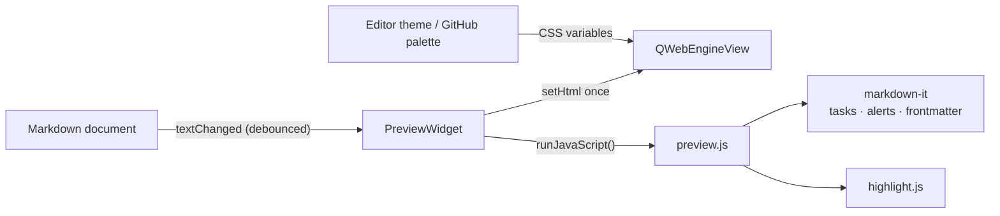

<div align="center">

# Katdown

KDE Kate Markdown preview plugin: GitHub theme with native and system color support.

[](LICENSE)
&nbsp;
&nbsp;

</div>

Kate's built-in preview uses a plain Qt renderer that looks nothing like GitHub. The other option, `kmarkdownwebview`, was abandoned in 2020 and never ported to KF6. This plugin fills that gap: it renders with the actual [github-markdown-css](https://github.com/sindresorhus/github-markdown-css), so headings, tables, blockquotes, task lists, and alerts match what you would see on github.com. Fully offline.

## Screenshots

| GitHub style | Theme-matched style |
| :----------: | :-----------------: |
|  |  |

## Installation

### Arch Linux (recommended)

Install [`katdown-git`](https://aur.archlinux.org/packages/katdown-git) from the AUR with any helper:

```bash
yay -S katdown-git   # or: paru -S katdown-git
```

The package builds from the latest commit and pulls in every dependency. Then enable it: Settings, then Configure Kate, then Plugins, then check Katdown.

### Windows

Download `katdown-<version>-windows-x86_64.zip` from the [latest release](https://github.com/uwuclxdy/katdown/releases/latest), unzip it, close Kate, and run this in an **elevated** PowerShell:

```powershell
powershell -ExecutionPolicy Bypass -File install.ps1
```

It finds Kate on its own, or takes `-KateDir "D:\Kate"`. `-WhatIf` shows what it would do, `-Uninstall` removes exactly what it installed. 
Then enable it: Settings -> Configure Kate -> Plugins -> check Katdown.

The zip is about 90 MB and unpacks to roughly 220 MB, because Kate for Windows ships no Qt WebEngine, and the preview is a web view, so the runtime comes along with the plugin. Windows resolves a plugin's dependencies from the folder holding `kate.exe`, which is why those files install next to Kate rather than beside the plugin.

Two limits worth knowing before you download it:

- Kate has to come from the [installer](https://kate-editor.org/get-it/), **Microsoft Store version is not supported**.
- The build targets Kate's Qt 6.11.x. `install.ps1` checks and refuses on a mismatch, because installing anyway produces a plugin that never loads and never says why.

### Build from source

```bash
git clone https://github.com/uwuclxdy/katdown.git
cd katdown
cmake -B build -S . -DCMAKE_BUILD_TYPE=RelWithDebInfo -DCMAKE_INSTALL_PREFIX=/usr
cmake --build build
```

**System-wide** install (loads in every Kate launch):

```bash
sudo cmake --install build
```

**User-local** install (no root, but needs a re-login to take effect):

```bash
cmake --install build --prefix ~/.local
mkdir -p ~/.config/environment.d
printf 'QT_PLUGIN_PATH=%s/.local/lib/qt6/plugins\n' "$HOME" \
    > ~/.config/environment.d/katdown.conf
```

Enable the plugin after installing: Settings -> Configure Kate -> Plugins -> check Katdown.

> [!NOTE]
> Qt WebEngine is initialized from inside Kate. On some setups you may see a console warning about `Qt::AA_ShareOpenGLContexts`. It is harmless in practice.

## Requirements

The AUR package resolves these for you. You only need them to build from source.

- Kate / KTextEditor 6 (KF6)
- Qt 6 with WebEngine

On Arch:

```bash
sudo pacman -S --needed base-devel cmake extra-cmake-modules \
    ktexteditor qt6-webengine kcoreaddons ki18n kconfig kxmlgui ksyntaxhighlighting
```

Building it yourself on Windows means [KDE Craft](https://community.kde.org/Craft) with MSVC 2022, since the plugin has to match the ABI of Kate's own build and Kate ships no headers. `.github/workflows/windows.yml` is the working recipe.

## Usage

Open any Markdown file in Kate:

```bash
kate path/to/notes.md
```

Then trigger the preview in one of three ways:

- press <kbd>Ctrl</kbd>+<kbd>Shift</kbd>+<kbd>M</kbd>, or
- click the Katdown button in the main toolbar (Settings, then Toolbars Shown, then Main Toolbar if it is hidden), or
- use Tools, then Katdown.

The button is greyed out unless the active tab is a Markdown document. The preview tab tracks the document and re-renders as you edit. Triggering it again focuses the existing tab instead of opening a second one.

Closing the document's editor tab leaves the preview showing its last content, with `(closed)` in the tab title. Reopening the file re-attaches that same preview tab and it tracks again.

## Configuration

Settings -> Configure Kate -> (Plugins -> enable `Katdown`) -> Katdown.


| Setting | Options | What it does |
|---------|---------|--------------|
| Style | GitHub / Match editor or system theme | GitHub uses GitHub's palette. Match recolors the same layout from your active editor theme. |
| GitHub variant | Auto / Light / Dark | Which GitHub palette to use. Auto follows whether your system is light or dark. Only applies in GitHub style. |
| Load media previews from remote URLs | On / Off (default) | When on, images referencing `http(s)` URLs are fetched and rendered. When off (the default), the preview loads no remote resources and works fully offline. Images with paths relative to the document always load regardless of this setting. |

Change the shortcut under Settings, then Configure Keyboard Shortcuts, search for Katdown.

<details>
    <summary><h2>How it works</h2></summary>

The preview is a `QWebEngineView` added to Kate's tab area through `KTextEditor::MainWindow::addWidget`. The page is one self-contained HTML document with the assets inlined, so nothing loads over the network.



- Layout and typography come from `github-markdown-css`. The built-in color values are stripped out so the plugin can drive them from CSS custom properties.
- Markdown is parsed by [markdown-it](https://github.com/markdown-it/markdown-it). Small bundled plugins add task-list checkboxes and GitHub alerts, and leading YAML frontmatter is parsed with [js-yaml](https://github.com/nodeca/js-yaml) into a metadata table.
- Code highlighting uses [highlight.js](https://github.com/highlightjs/highlight.js). In GitHub style it uses the github/github-dark themes. In theme-matched style the token colors are generated at runtime from `KTextEditor::View::theme()`, so they line up with the editor.

Code highlighting is close to GitHub but not byte-identical, because GitHub uses its own server-side highlighter rather than highlight.js. If needed, [starry-night](https://github.com/wooorm/starry-night) is a faithful port of GitHub's highlighter and could replace highlight.js.

</details> 

## Development

Build, then run Kate that loads the freshly built plugin without installing it:

```bash
cmake -B build -S . -DCMAKE_BUILD_TYPE=Debug
cmake --build build -j"$(nproc)"
QT_PLUGIN_PATH="$PWD/build/bin" kate some-file.md
```

Source layout:

- `src/plugin.*` plugin entry point and config page registration
- `src/pluginview.*` per-window action, toolbar/menu wiring, opening the tab
- `src/previewwidget.*` the web view, rendering, and theme derivation
- `src/configpage.*` the settings page
- `src/settings.*` persisted settings
- `data/` bundled HTML, CSS, JS, and the qrc

## Credits

- [github-markdown-css](https://github.com/sindresorhus/github-markdown-css) by Sindre Sorhus
- [markdown-it](https://github.com/markdown-it/markdown-it)
- [highlight.js](https://github.com/highlightjs/highlight.js)
- [js-yaml](https://github.com/nodeca/js-yaml)

## License

GPL-3.0-or-later. See [LICENSE](LICENSE).
